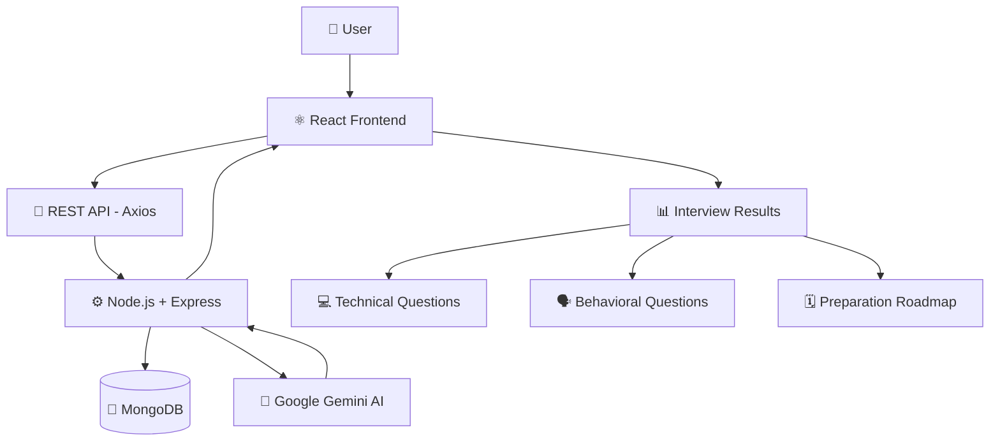

 <div align="center">

# 🎯 AI Interview Preparation Platform

### 🤖 AI-Powered Resume Analysis & Interview Preparation

A full-stack AI application that helps students prepare for technical interviews through resume analysis, job-match scoring, technical and behavioral questions, skill-gap identification, and a personalized preparation roadmap.


**[🚀 Key Features](#-key-features) · [🏗️ Architecture](#️-system-architecture) · [📸 Screenshots](#-screenshots) · [▶️ Run Locally](#️-run-locally)**

</div>

---

## 📑 Table of Contents

1. [About the Project](#-about-the-project)
2. [Problem Statement](#-problem-statement)
3. [Key Features](#-key-features)
4. [System Architecture](#️-system-architecture)
5. [Tech Stack](#️-tech-stack)
6. [Screenshots](#-screenshots)
7. [Project Structure](#-project-structure)
8. [Run Locally](#️-run-locally)
9. [API Endpoints](#-api-endpoints)
10. [Future Improvements](#-future-improvements)
11. [Author](#-author)

---

## 🎯 About the Project

**AI Interview Preparation Platform** is a full-stack web application designed to make interview preparation easier and more structured for students and job seekers.

The application combines React, Node.js, Express.js, MongoDB, and Google Gemini AI to analyze resumes, evaluate job-description matches, generate interview questions, identify skill gaps, and provide a preparation roadmap.

## 💡 Problem Statement

Students often struggle to identify the skills required for a target role and prepare for interviews in a structured way.

This platform brings several preparation activities into one place:

* 📄 Resume analysis and feedback
* 🎯 Job-match scoring
* 💻 Technical interview practice
* 🗣️ Behavioral interview preparation
* 📊 Skill-gap identification
* 🗓️ Personalized preparation roadmap

## 🚀 Key Features

<table>
<tr>
<td valign="top" width="50%">

### 📄 Resume Analysis

* AI-powered resume insights
* Job-description matching
* Resume relevance assessment

### 💻 Technical Questions

* Role-related technical questions
* Programming and web-development topics
* Model answers where available

</td>
<td valign="top" width="50%">

### 🗣️ Behavioral Questions

* Common behavioral interview questions
* Question intentions
* STAR-method guidance

### 📊 Skill Gaps & Roadmap

* Skills requiring improvement
* Preparation priorities
* Structured learning roadmap

</td>
</tr>
</table>

### 🔐 Authentication and Reports

* User registration and login
* JWT-based authentication
* Protected application routes
* Resume report download as PDF

---

## 🏗️ System Architecture



---

## 🛠️ Tech Stack

| Category          | Technologies                            |
| ----------------- | --------------------------------------- |
| Frontend          | React.js, JavaScript, HTML5, CSS3, Vite |
| Backend           | Node.js, Express.js                     |
| Database          | MongoDB, Mongoose                       |
| AI Integration    | Google Gemini AI API                    |
| Authentication    | JWT, HTTP-only cookies                  |
| API Communication | Axios, REST APIs                        |
| File Upload       | Multer                                  |
| Tools             | Git, GitHub, Postman, VS Code           |

---

## 📸 Screenshots

A few screens from the application, showcasing the interview questions and preparation roadmap.

| **💻 Technical Questions**                                        | **🗣️ Behavioral Questions**                                        |
| ----------------------------------------------------------------- | ------------------------------------------------------------------- |
|  |  |

| **🏠 Home Page**                         | **🗓️ Preparation Roadmap**                           |
| ---------------------------------------- | ----------------------------------------------------- |
|  |  |

> 💡 Keep the `ia screen short/` folder in the same directory as this README when pushing to GitHub.

---

## 📁 Project Structure

```text
interview-ai-yt/
├── Backend/
├── Frontend/
├── ia screen short/
│   ├── home.png
│   ├── technical-questions.png
│   ├── behavioral-questions.png
│   └── roadmap.png
├── .gitignore
└── README.md
```

*This is a simplified overview; keep your actual project folders and files unchanged.*

---

## ▶️ Run Locally

### 1. Install backend dependencies

```bash
cd Backend
npm install
```

Create a `Backend/.env` file with your own database connection and Gemini API key, using the exact variable names required by your code.

Start the backend using the script configured in `Backend/package.json`. For example:

```bash
npm run dev
```

### 2. Install frontend dependencies

Open a second terminal:

```bash
cd Frontend
npm install
npm run dev
```

Open the local frontend URL shown in your terminal, usually `http://localhost:5173`.

**Security:** Never commit `.env` files, API keys, or database passwords to GitHub.

---

## 🔌 API Endpoints

| Method | Endpoint                             | Purpose                        |
| ------ | ------------------------------------ | ------------------------------ |
| POST   | `/api/auth/register`                 | Register a user                |
| POST   | `/api/auth/login`                    | Log in                         |
| POST   | `/api/auth/logout`                   | Log out                        |
| GET    | `/api/auth/get-me`                   | Get the current user's details |
| POST   | `/api/interview/`                    | Generate an interview report   |
| GET    | `/api/interview/report/:interviewId` | Retrieve a report              |

*Verify endpoint paths against your actual backend route configuration before publishing.*

---

## 🔮 Future Improvements

* 🎤 Real-time mock interview practice
* 🎙️ Voice-based question and answer support
* 📈 Interview preparation progress tracking
* 🧠 More personalized recommendations
* 📱 Improved mobile responsiveness
* 🧪 Expanded automated testing

---

## 👩‍💻 Author

**Vaishnavi Ashok Ubarhande**

B.Tech — Computer Science and Engineering
Vellore Institute of Technology, Bhopal

GitHub: [VaishnaviUbarhande](https://github.com/VaishnaviUbarhande)

---

<div align="center">

### Built with ❤️ using React, Node.js, Express, MongoDB, and Google Gemini AI

</div>
